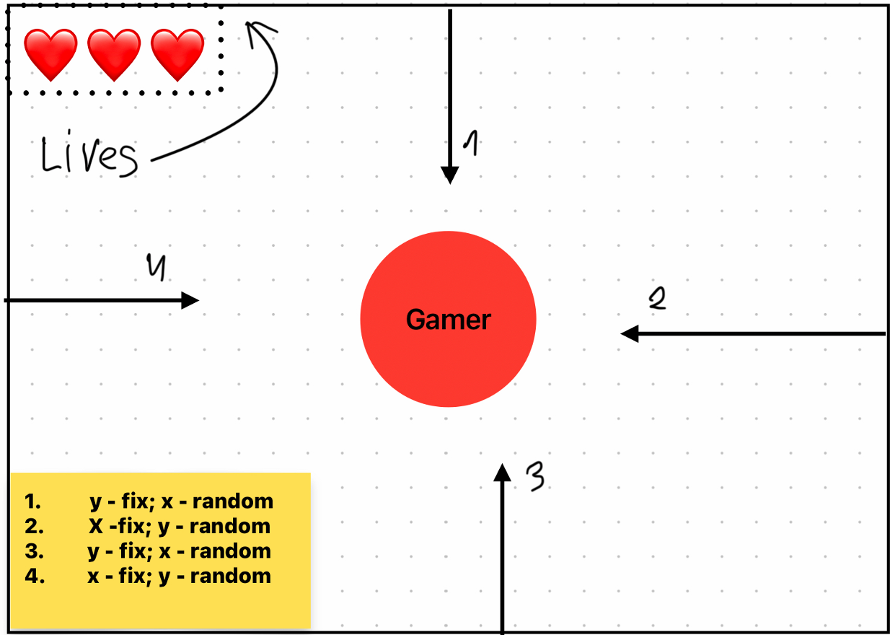
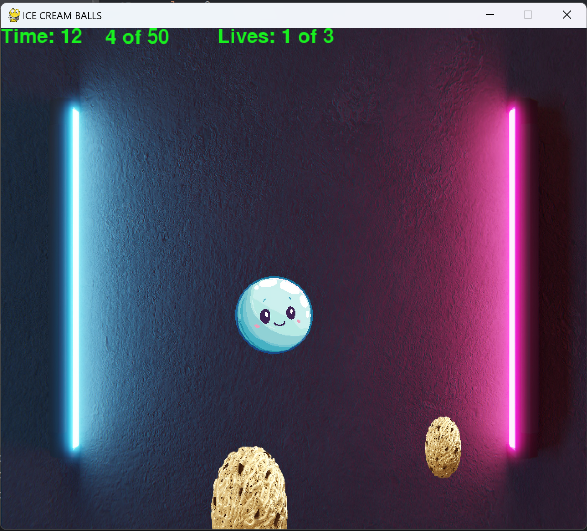
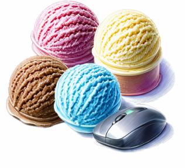

# The game "Ice cream balls"

The game "Ice cream balls" consists of eating balls with a player. The task is to eat 50 balls 
smaller than the player himself. The player's size increases by 1 after eating a small ball (in 
previous commits by 10). If a player eats a ball that is bigger than him, then his life is taken away 
(3 lives in total). Below is a picture of the game project:

### The player is controlled using the mouse. This is a screenshot of the game:

## Nice the game!

